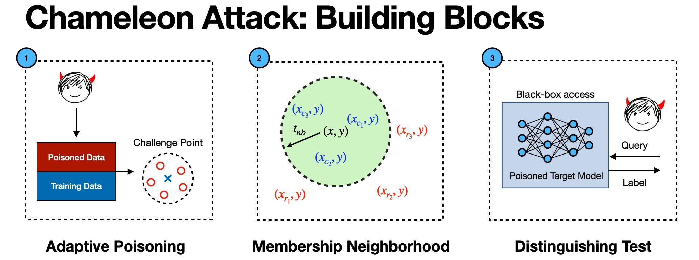

# CHAMELEON: INCREASING LABEL-ONLY MEMBERSHIP LEAKAGE WITH ADAPTIVE POISONING
**Authors: Harsh Chaudhari, Giorgio Severi, Alina Oprea, Jonathan Ullman.**

Code for our [Chameleon: Increasing Label-Only Membership Leakage with Adaptive Poisoning](https://iclr.cc/virtual/2024/poster/19475) paper that will appear at ICLR 2024.

## Local Installation
This repository was developed on python version `3.9.13`. Please refer to `requirements.txt` for specific packages. 



Our Chameleon attack works in three stages:

**I) Adaptive Poisoning Stage** 
Based on Algorithm-2 in our paper, the script below will train atmost `2 x (maxiters+1) x outmodels` ResNet-18 models for 500 challenge points using our adaptive poisoning strategy. For better results at the expense of additional time, consider increasing the `outmodels` and `maxiters` variables as needed. 

```shell
python3 -u train_out_models.py -d [--data] -out [--outmodels] -tp [--psnthresh] -kmax [--maxiters]  -c [--cuda]
```

The arguments for the script are as follows:
```shell
data (str) -- Dataset to run the attack. Default: 'cifar10' (options: 'cifar10', 'cifar100', 'gtsrb').
outmodels (int) -- Number of OUT models. Default: '4'.
psnthresh (float) -- Poisoning Threshold. Default: '0.13'.
maxiters (int) -- Maximum Poisoning Iterations. Default: '6'.
cuda (int) -- The GPU device number to run the attack. Default: '0'.
```

**II) Membership Neighborhood Stage**
The script below finds candidates for the 500 challenge points in the membership neighborhood space. The script can be run on a different GPU as soon as the first iteration of the Adaptive Poisoning stage is compeleted. Check if `2 x outmodels` in `ShadowModels/OPModels/` folder  are present before running this script. 

```shell
python3 -u find_neighbors.py -d [--data] -aug [--augrep] -tnb [--nbrthresh]  -c [--cuda]
```

The arguments for the script are as follows:
```shell
data (str) -- Dataset to run the attack. Default: 'cifar10' (options: 'cifar10', 'cifar100', 'gtsrb').
augrep (int) -- Number of random augmentations to generate. Default: '128'.
nbrthresh (float) -- Neighborhood Threshold. Default: '0.75'.
cuda (int) -- The GPU device number to run the attack. Default: '0'.
```

Either increase the `augrep` or `nbrthresh` variable, in case the algorithm is not able to find neighbors. Note that, increasing the `nbrthresh` to a high value could potentially decrease the TPR scores.

**III) Distinguishing Test** 
The script below trains `tgtmodels` number of target models separately which includes the poisoned set created from our Adaptive poisoning stage. 

```shell
python3 -u train_target_models.py -d [--data] -tgt [--tgtmodels]  -c [--cuda]
```

The arguments for the script are as follows:
```shell
data (str) -- Dataset to run the attack. Default:'cifar10' (options: 'cifar10', 'cifar100', 'gtsrb').
tgtmodels (int) -- Number of Target models. Default: '16'.
cuda (int) -- The GPU device number to run the attack. Default: '0'.
```

The script below runs our distinguishing test on the target models and prints out the TPR at different FPRs.

```shell
python3 -u run_dtest.py -d [--data] -aug [--augrep] -c [--cuda]
```

The arguments for the script are as follows:
```shell
data (str) -- Dataset to run the attack. Default: 'cifar10' (options: 'cifar10', 'cifar100', 'gtsrb').
augrep (int) -- Number of augmentations per challenge point. Default: '128'.
cuda (int) -- The GPU device number to run the attack. Default: '0'.
```

The scores are saved in the `SavedScores` folder. ROC curves can be found in the `Figures` folder.